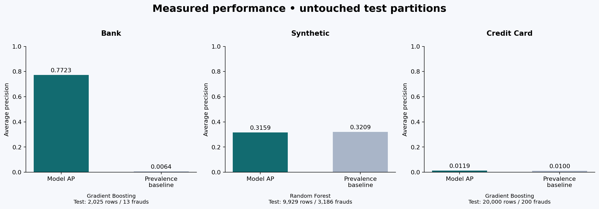

# Financial Fraud Detection — Project Report

## Objective
Identify transactions requiring investigation and compare machine learning, deep learning, regression and anomaly approaches using the supplied data. Streamlit is the implemented dashboard.

## Data audit
| Source | Reviewed rows | Fraud rows | Excluded labels |
|---|---:|---:|---:|
| bank | 10,125 | 68 | 2 |
| synthetic | 50,000 | 16,067 | 0 |
| credit_card | 100,000 | 1,000 | 0 |

The bank workbook also contains `isFraud - Copy`, a duplicate target representation, and two `Not reviewed` records. Neither label copy is a feature; unreviewed rows are not assigned a negative label. The credit-card CSV is not the anonymized V1–V28 dataset assumed in some reference notebooks.

## Method
1. Load each source independently; remove exact duplicate records and reject unresolved labels.
2. Split before fitting any transformation. Bank and credit-card use stratified 60/20/20 splits; synthetic uses disjoint users with approximately the same fractions.
3. Use explicit feature allowlists, calendar extraction and log amount; impute/scale numerics and encode categoricals using training data only.
4. Train 13 candidate models. Fixed architecture and hyperparameters, with at most 20,000 stratified training rows and 5,000 for expensive kernel models. No evaluation rows are undersampled.
5. Optimize a separate threshold for each model using validation F2. Choose the primary classifier by validation AP, then evaluate frozen choices on test data.
6. Persist a selected pipeline per source, audited row splits, metrics and test predictions. Display test data in the dashboard; use the same pipeline for uploaded data.

## Measured results
| Dataset | Selected classifier | Test AP | Baseline AP | Precision | Recall | TP / FP / FN / TN |
|---|---|---:|---:|---:|---:|---|
| bank | Gradient Boosting | 0.7723 | 0.0064 | 80.00% | 61.54% | 8 / 2 / 5 / 2010 |
| synthetic | Random Forest | 0.3159 | 0.3209 | 32.09% | 100.00% | 3186 / 6743 / 0 / 0 |
| credit_card | Gradient Boosting | 0.0119 | 0.0100 | 1.08% | 63.50% | 127 / 11597 / 73 / 8203 |

The bank model detects 8 of 13 test frauds and produces 2 false alerts. Its performance is promising within this benchmark, but 13 positives give high sampling uncertainty. Random splits can also overstate future-time performance.

Synthetic and credit-card models have near-baseline ranking performance under these conservative features. The synthetic model flags all test rows at its validation F2 threshold; this is not useful operational detection. Credit-card precision is about 1%, close to its 1% prevalence. High default-label accuracy (99% by predicting no credit-card fraud) would disguise failure to detect fraud. No claim is made that these labels are random: feature inadequacy, generation logic and label quality require investigation.

## Feature availability decisions
Bank: transaction amount, old sender/recipient balances, type, branch, account type, time-of-day and supplied calendar features. Old balances are assumed available pre-event. Exclude new balances, IDs, flags, duplicated labels, arbitrary row counters and ambiguous unusual-login values.

Synthetic: amount, card age, transaction/device/merchant/card categories, location and calendar. Exclude user/transaction IDs and ambiguous account-balance, prior-fraud and whole-day transaction-count fields until their timing and provenance are confirmed. User IDs are used only for partitioning.

Credit-card: amount, transaction type, location and calendar. Transaction and merchant IDs are excluded from this conservative benchmark. More informative merchant/customer history may improve results if computed strictly from past events.

## Reference notebook review
- `Advanced_Financial_Fraud_Detection_Model_With_Dashboard (1)(2).ipynb`: useful transaction-analysis ideas, but hardcoded local paths, inconsistent labels and references to undefined model/test variables prevent a clean end-to-end run. The rebuilt pipeline uses the actual workbook schema.
- `Financial_Fraud_Detection_Cleaned(2).ipynb` and `Fraud_Detection_(1)(2).ipynb`: expect `creditcard.csv` with `Class` and/or V1–V28 features, unlike the supplied credit-card CSV. Some transformations/undersampling occur before later evaluation; the rebuilt project separates partitions before fitting.
- `EDA(1).ipynb`: exploratory reference with a generic `data.csv` path; the rebuilt loaders use explicit source names.
- `Data_Visualization_Info(2).ipynb`: generic visualization examples, not a complete fraud dashboard.
- `Data_Augmentation(2).ipynb`: image, text and generic time-series augmentation examples; these are not appropriate transaction-label augmentation and are not applied.

## Dashboard features
The dashboard uses five simple tabs: Data overview, Model results, Predict, Transaction replay and About the project. Overview contains location/type/date filters, label and alert counts, trends, score distribution, a confusion matrix and a downloadable review queue. Model results includes evaluation metrics and a precision-recall curve. Prediction supports CSV batches and one edited transaction. Replay processes 25 held-out rows per click. The About tab explains source checks, exclusions and warnings.

## Implemented versus extension scope
Implemented: local SQLite ETL, ML/deep learning training, anomaly comparison, inference, test reporting and Streamlit dashboard. Kafka/Spark ingestion, graph-based network detection, external email/SMS alerts and adaptive online retraining are future extensions from the broad brief. No production bank integration or Power BI file is claimed.

## Validation and reproducibility
The included tests verify non-overlapping splits, user isolation, target exclusion, schema rejection, unknown-category handling, all 13 metric records, confusion totals and serialized-model prediction consistency. Streamlit AppTest exercises every dataset, single prediction, replay and threshold changes. Package versions and random seeds are recorded; training logs and model-specific warnings are included.

## Presentation / viva notes
- Why classification? Fraud is a binary label; regression models are comparative numeric-score baselines.
- Why not accuracy alone? A majority-only classifier reaches 99% accuracy on the supplied credit-card dataset while detecting zero fraud.
- Why validation and test? Validation chooses the model and threshold; the test set measures those frozen decisions.
- What is deep learning here? A feed-forward MLP with three hidden layers, plus an encoder/bottleneck/decoder reconstruction model.
- Why no image augmentation or blanket outlier removal? Transaction labels need domain-valid transformations; extreme transactions may be the fraud signal.
- What is the strongest limitation? Data provenance and feature timing are unverified, and two datasets show weak signal. Bank positives are scarce.
- What is real-time here? Local replay and interactive prediction only; real streaming infrastructure is an extension.

## References
[scikit-learn leakage guidance](https://scikit-learn.org/stable/common_pitfalls.html) · [MLPClassifier](https://scikit-learn.org/stable/modules/generated/sklearn.neural_network.MLPClassifier.html) · [Streamlit testing](https://docs.streamlit.io/develop/api-reference/app-testing)
